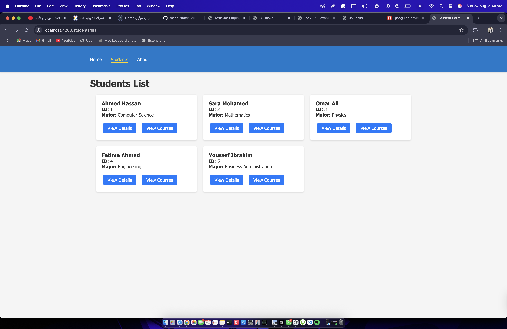
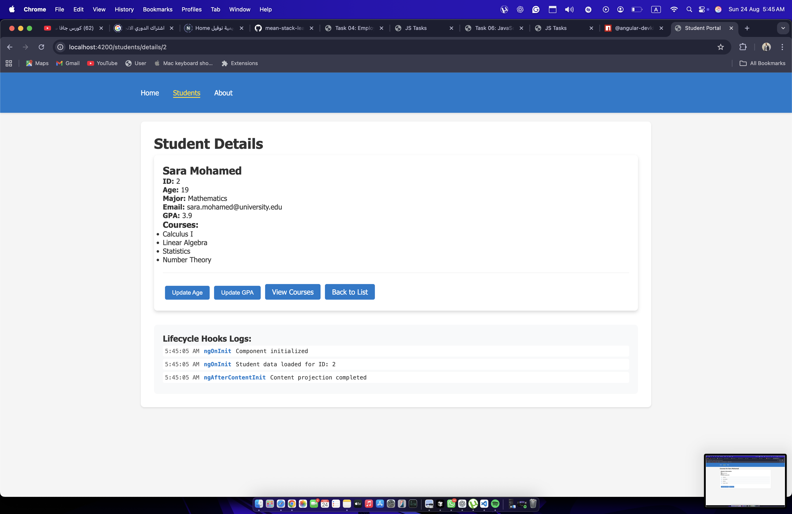
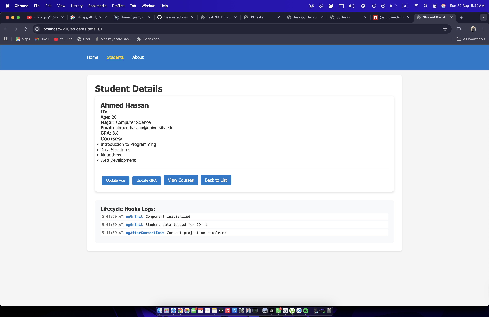
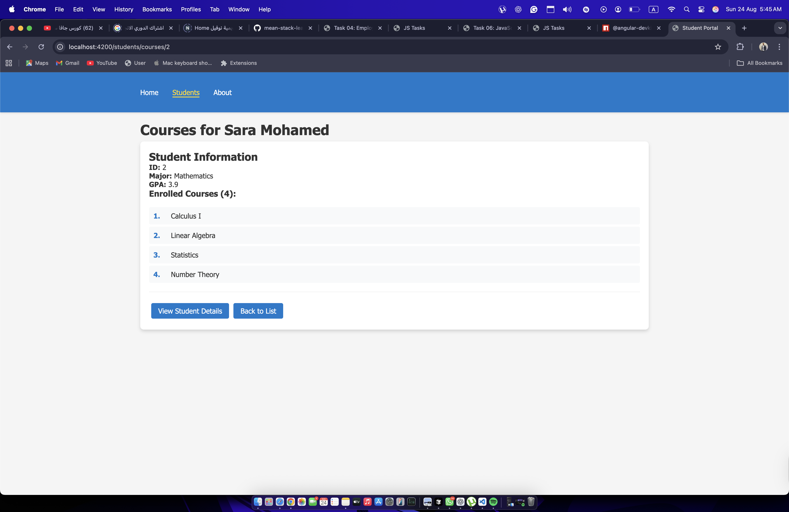

# Student Portal Angular Task

An Angular application for managing student information and courses using standalone components and routing.

## Features
- Student listing with grid layout
- Student details view with lifecycle hooks
- Course enrollment management
- Navigation between different views
- Responsive design

## Screenshots

### Students List View

*Main view showing all students with their basic information*

### Student Details View

*Detailed view of student information with lifecycle hooks demonstration*

### Student Information

*Individual student information display*

### Student Courses View

*Course enrollment details for individual students*

## Technical Implementation
- Angular 16+ with standalone components
- Angular Router for navigation
- Lifecycle hooks demonstration
- Service-based state management
- TypeScript strict mode compliance

## Project Structure
```
src/
├── app/
│   ├── pages/
│   │   ├── students/
│   │   │   ├── student-list/
│   │   │   ├── student-details/
│   │   │   └── student-courses/
│   │   └── not-found/
│   └── shared/
│       └── student.service.ts
└── assets/
```

## Running the Application
```bash
# Install dependencies
npm install

# Start development server
ng serve

# Access the application
open http://localhost:4200
```